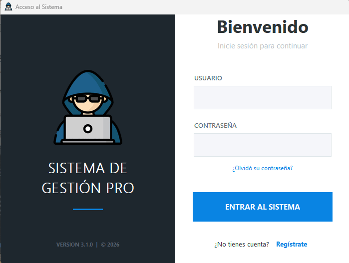
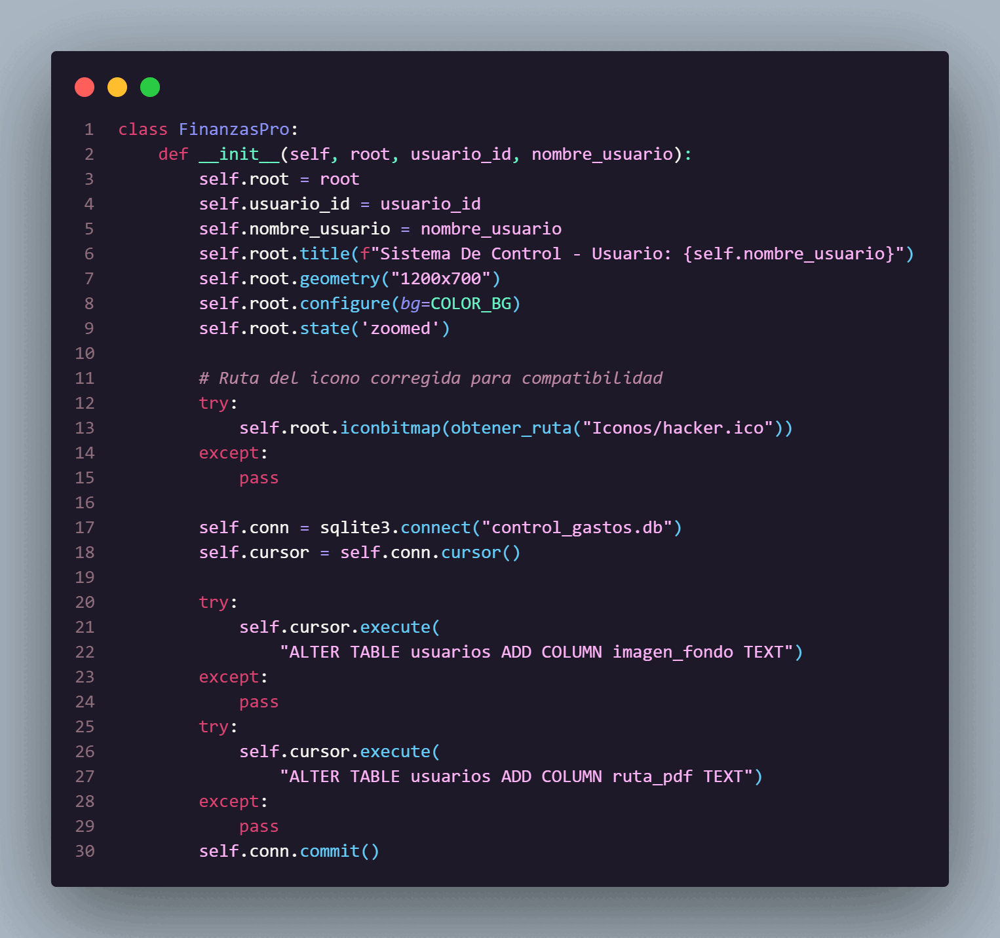
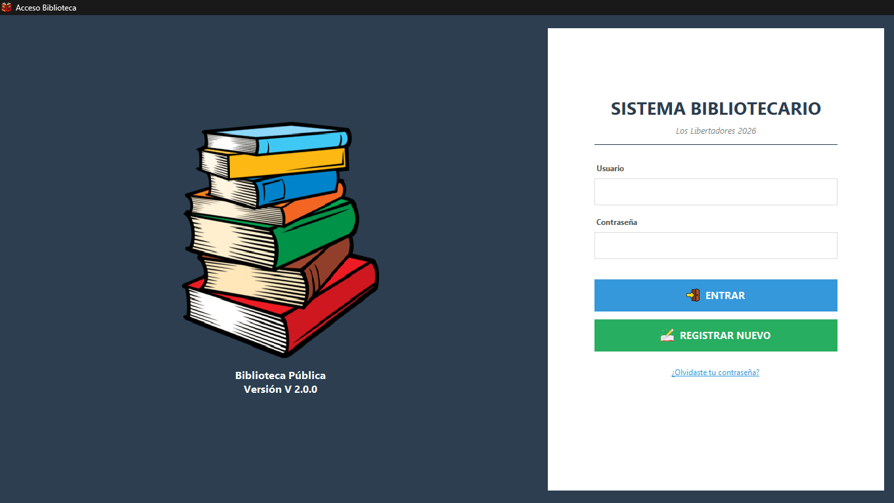
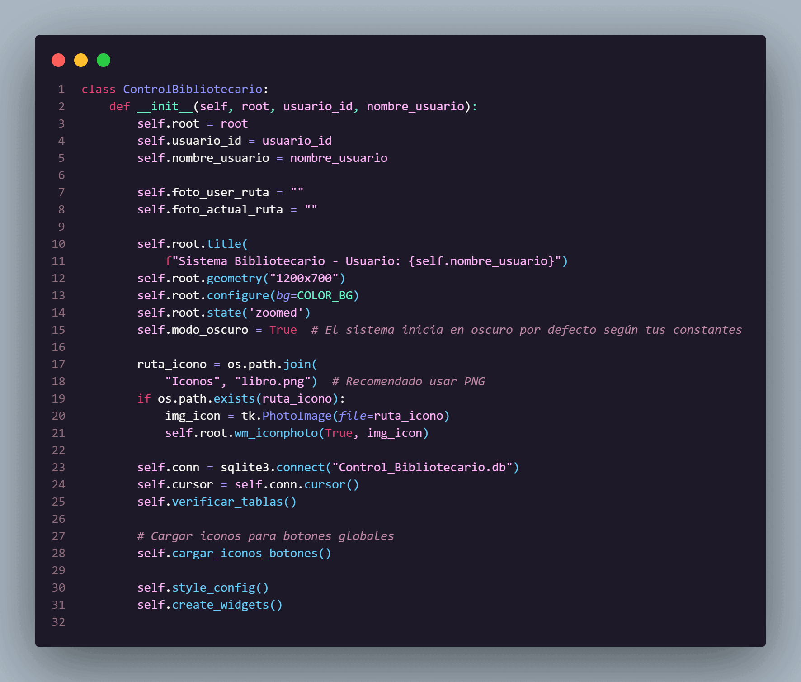
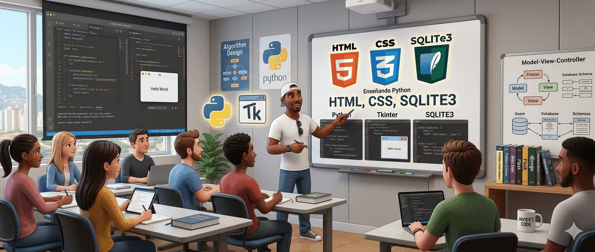
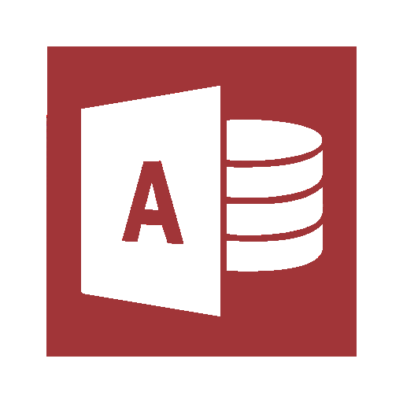
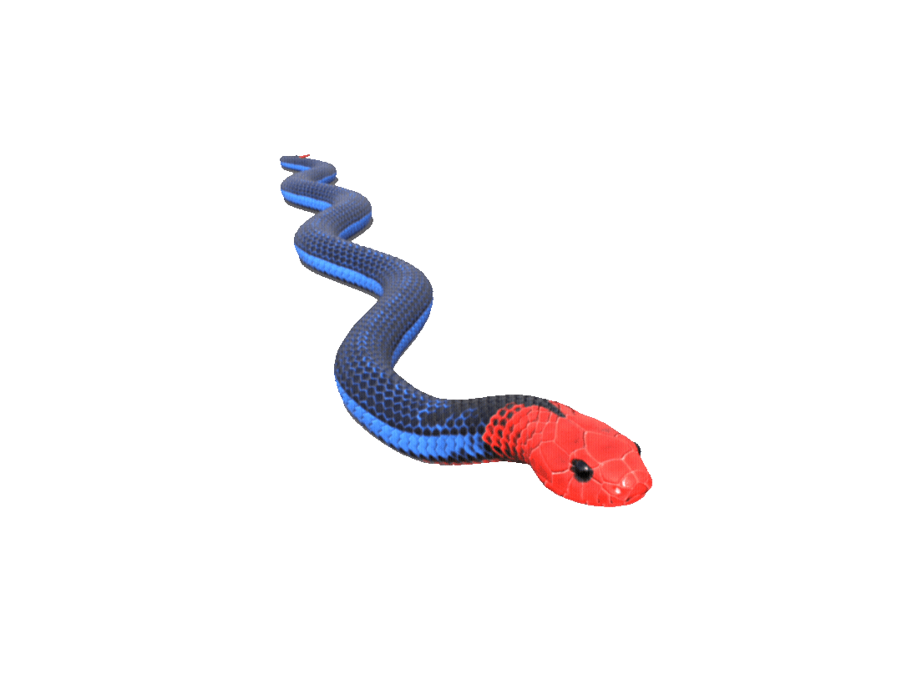

  

<h1 align="center"> Hi, Welcome, I'm Omar Pinto </h1>

  <strong>Desarrollador de Software en formación | Construyendo soluciones con Python | Estudiante de Informática | Apasionado por el desarrollo de software y la automatización.</strong>

---

## <picture></picture> Mis Logros <picture>

  
  

  

---

## <picture></picture> Acerca de mí <picture>

<picture> </picture>

Soy un desarrollador enfocado en la creación de soluciones eficientes mediante software de escritorio y gestión de bases de datos. Me apasiona transformar ideas en herramientas funcionales que faciliten la administración de datos.

- 🔭 **Proyectos actuales:** Desarrollo de aplicaciones robustas con **Python (CustomTkinter)** y **SQLite3**.

- 🌱 **En aprendizaje:** Arquitectura de software, patrones de diseño y optimización avanzada de bases de datos relacionales.

- 👯 **Colaboraciones:** Abierto a proyectos de código abierto sobre herramientas de gestión y automatización.

- ⚡ **Dato curioso:** He comprobado que a veces "borrarlo todo y empezar de nuevo" es la forma más rápida de alcanzar la excelencia.

---
## <picture>  </picture> Mis proyectos 

<table align="center">
  <tr> <!-- Agregamos esta etiqueta para abrir la fila -->
    <td align="center">
       
      <b>Finanza Pro</b>
    </td>
    <td align="center">
       
      <b>Code Pro</b>
    </td>
    <td align="center">
       
      <b>Biblioteca Publica</b>
    </td>
    <td align="center">
       
      <b>Code Biblioteca Publica</b>
    </td>
  </tr>
</table>

---

## <picture>  </picture> Galería Personal 
 
<table align="center">
  <tr>
    <td align="center">
       
      <b>Momento 1</b>
    </td>
    <td align="center">
       
      <b>Momento 2</b>
    </td>
    <td align="center">
       
      <b>Momento 3</b>
    </td>
</table>

---

### <picture>   </picture> Tecnologías y Herramientas 

 

<table align="center">
  <!-- Fila 1 -->
  <tr>
    <td align="center">
      
    </td>
    <td align="center">
      
    </td>
    <td align="center">
      
    </td>
    <td align="center">
      
    </td>
  </tr>
  <!-- Fila 2 -->
  <tr>
    <td align="center">
      
    </td>
    <td align="center">
      
    </td>
    <td align="center">
      
    </td>
    <td align="center">
      
    </td>
  </tr>
  <!-- Fila 3 -->
  <tr>
    <td align="center">
      
    </td>
    <td align="center">
      
    </td>
    <td align="center">
      
    </td>
    <td align="center">
      
    </td>
  </tr>
  <!-- Fila 4 -->
  <tr>
    <td align="center">
      
    </td>
    <td align="center">
      
    </td>
    <td align="center">
      
    </td>
    <td align="center">
      
    </td>
  </tr>
</table>

---

## <picture>  </picture> Proyectos Destacados

*   **Finanzas Pro:** Sistema de gestión financiera personal.
*   **Sistema Bibliotecario Los Libertadores:** Software administrativo para el control de bibliotecas.
*   **Bio Control:** Herramientas de censo y gestión comunitaria.

---
## <picture>  </picture> Estadísticas de GitHub

   
  &nbsp;&nbsp;&nbsp;&nbsp;&nbsp;&nbsp;&nbsp;&nbsp;&nbsp;&nbsp;
  

---

## <picture>  </picture> Bandera De Venezuela

  
  
  

---

## <picture>  </picture> Conecta conmigo 

  
  &nbsp;&nbsp;&nbsp;&nbsp; <!-- Espacio de separación -->
  

---
## <picture>  </picture> Gráfico de contribuciones 

  <table border="0">
    <tr>
      <td align="center">
        <!-- Tus lenguajes reales basados en tu actividad -->
        
      </td>
      <td align="center" style="padding: 0 20px;">
        <!-- Logo de GitHub animado -->
        
      </td>
      <td align="center">
        <!-- Tus estadísticas generales reales -->
        
      </td>
    </tr>
  </table>

   

  <!-- Tus detalles de perfil reales -->
  

